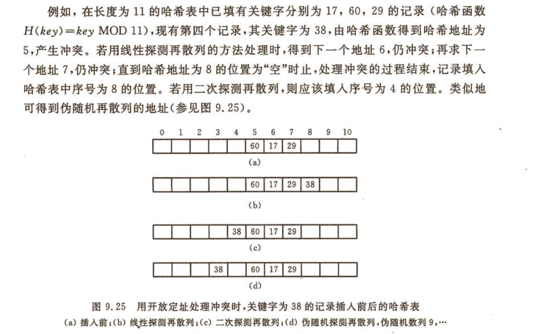

# Two Sum
`知识点: 1.哈希表(C++中的unordered_map) 2.emplace 函数`

最佳代码：
```cpp
vector<int> twoSum(vector<int>& nums, int target) {
    unordered_map<int, int> num_map;
    for (int i = 0; i < nums.size(); i++)
    {
        auto result = num_map.find(target - nums[i]);
        if (result != num_map.end())
            return vector<int>({ result->second ,i });
        num_map.emplace(nums[i], i);
    }
    throw "Target not found!\n";
}
```
## 1.哈希表
### 定义
一种采用哈希函数达到快速查找、插入、删除操作的数据结构，只需要大约O(1)的时间复杂度
###### 补充说明：要在readme文件中插入公式，可以在这个[网站](https://www.codecogs.com/latex/eqneditor.php"在线LaTeX公式编辑器")中输入公式后，按照这种格式输入:  
``
### 哈希冲突
哈希函数是通过key与索引index一一对应的方式来实现直接快速查找，因此在存放元素的时候就要保证每一个key值只能对应一个index值，所以哈希函数的设计就非常重要，但是为了提高空间利用率以及控制哈希函数的复杂性，通常会出现不可避免的哈希冲突，即插入元素的时候通过哈希函数计算出的key1->index1与key2->index2的两个index相同，例如字典中通过拼音检索字符时，"按"与"安"都对应检索index"an"，这就是需要解决的哈希冲突
### 哈希冲突解决方法
#### 1 开放定址法(即寻找下一个不冲突的地址存放)
假设哈希函数为H(key)=key MOD m，m为表长，此时采用开放定址法则有新的定址函数L(key)=(H(key)+d) MOD m，d有三种取值方式：  
(1) 线性探测再散列 )  
(2) 二次探测再散列   
(3) 伪随机探测再散列 d在一组伪随机数列中取值
具体例子如下图所示：



## 2.emplace函数
